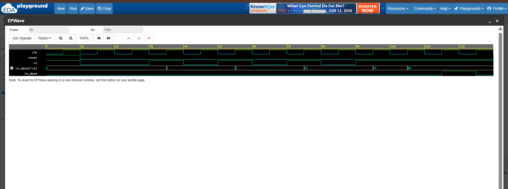

# 📥 UART Receiver (UART RX) using Verilog HDL

> 🚀 A Finite State Machine (FSM)-based UART Receiver designed using Verilog HDL for serial data reception and reconstruction.

---

## 📖 Overview

UART (Universal Asynchronous Receiver Transmitter) is one of the most widely used serial communication protocols in embedded systems, microcontrollers, and FPGA applications.

This project implements a UART Receiver capable of receiving serial data and reconstructing the original 8-bit data using an FSM-based approach.

---

## ✨ Features

✅ Verilog HDL Implementation

✅ FSM-Based UART Reception

✅ Start Bit Detection

✅ 8 Data Bits Reception (LSB First)

✅ Stop Bit Verification

✅ Data Reconstruction

✅ Reception Complete Signal (`rx_done`)

✅ Testbench Verification

✅ EPWave Simulation Analysis

---

# 📂 Repository Structure

```text
Verilog-UART-Receiver/
│
├── uart_rx.v
├── uart_rx_tb.v
├── uart_rx_waveform.png
└── README.md
```

---

# 📡 UART Frame Format

```text
| Start | D0 | D1 | D2 | D3 | D4 | D5 | D6 | D7 | Stop |
|   0   |          8 Data Bits          |   1   |
```

### Note

UART receives data **LSB (Least Significant Bit) First**.

---

# 📥 Inputs

| Signal | Width | Description |
|----------|--------|-------------|
| clk | 1-bit | System Clock |
| reset | 1-bit | Asynchronous Reset |
| rx | 1-bit | Serial Input |

---

# 📤 Outputs

| Signal | Width | Description |
|----------|--------|-------------|
| rx_data | 8-bit | Received Data |
| rx_done | 1-bit | Reception Complete |

---

# 🚦 FSM States

| State | Function |
|---------|-----------|
| IDLE | Wait for Start Bit |
| START | Confirm Start Bit |
| DATA | Receive 8 Data Bits |
| STOP | Verify Stop Bit |

---

# 🧪 Test Case

Serial Input Received:

```text
Start → 0 → 1 → 0 → 1 → 0 → 1 → 0 → 1 → Stop
```

Reconstructed Data:

```text
rx_data = 10101010
```

---

# 📷 Simulation Waveform

The waveform below verifies successful UART reception.



---

# 🛠️ Tools Used

💻 Verilog HDL

🧪 EDA Playground

📈 EPWave

🌐 GitHub

---

# 🎯 Learning Outcomes

Through this project, I gained practical experience in:

🔹 FSM-Based Design

🔹 Serial Communication Protocols

🔹 UART Reception Mechanism

🔹 LSB-First Data Reconstruction

🔹 Testbench Development

🔹 Functional Verification

🔹 Waveform Analysis

---

# 🚀 Future Enhancements

This UART Receiver can be extended by adding:

📡 Baud Rate Generator

🔄 Integration with UART Transmitter

📨 Complete UART Communication System

🖥️ FPGA Implementation

---

# 👩‍💻 Author

**Aneesa Pattan**

Electronics and Communication Engineering (ECE) Student

Aspiring VLSI & RTL Design Engineer 🚀

---

## ⭐ If you found this project interesting, consider starring the repository!

> *"Receiving data correctly is just as important as transmitting it."* 📥✨
